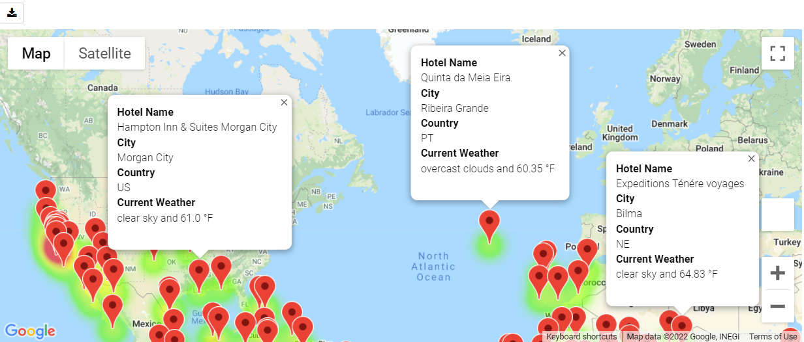
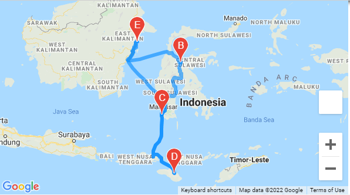

# World_Weather_Analysis
Making API calls, using Pandas to analyze and Matplotlib and gmaps

## PlanMyTrip App

PlanMyTrip App provides real-time suggestions for our client's ideal hotels (currently sampling 2000 random cities around the world). I narrowed that to hotels that were (1) within sample range of latitude and longitude and that (2) provided the right kind of weather for the client.

## Basic Project Plan

Here's an outline of your project plan:

- **Task:** Collect and analyze weather data across cities worldwide.
- **Purpose:** PlanMyTrip will use the data to recommend ideal hotels based on clients' weather preferences. Additionally use city data to create a travel itinerary. This code can be adjusted.
- **Method:** 
  - Create a Pandas DataFrame with 500 or more of the world's unique cities and their weather data in real time. This process will entail collecting, analyzing, and visualizing the data. 
  - I use input statements (sourced from the client) to filter the data for their weather preferences, which will be used to identify potential travel destinations and nearby hotels. 
  - From the list of potential travel destinations, the beta tester will choose four cities to create a travel itinerary. Finally, using the Google Maps Directions API, you will create a travel route between the four cities as well as a marker layer map.

My analysis of the data is split into three main parts, or stages.

1. **Collect the Data**

   - Use the NumPy module to generate more than 2,000 random latitudes and longitudes.
   - Use the citipy module to list the nearest city to the latitudes and longitudes.
   - Use the OpenWeatherMap API to request the current weather data from each unique city in your list.
   - Parse the JSON data from the API request.
   - Collect the following weather data from the JSON file and add it to a DataFrame

2. **Exploratory Analysis with Visualization**

   - Use input statements to retrieve customer weather preferences
   - use those preferences to identify potential travel destinations and nearby hotels
   - Then, show those destinations on a gmaps marker layer map with pop-up markers.

3. **Visualize Travel Data**

   Create a heatmap with pop-up markers that can display information on specific cities based on a customer's travel preferences. Steps:

   1. Filter the Pandas DataFrame based on user inputs for (currently sampled) a minimum and maximum temperature.
   2. Create a heatmap for the new DataFrame.
   3. Find a hotel from the cities' coordinates using Google's Maps and Places API, and Search Nearby feature.
   4. Store the name of the first hotel in the DataFrame.
   5. Add pop-up markers to the heatmap that display information about the city, current maximum temperature, and a hotel in the city.

**Sample itinerary of four cities:**

 
